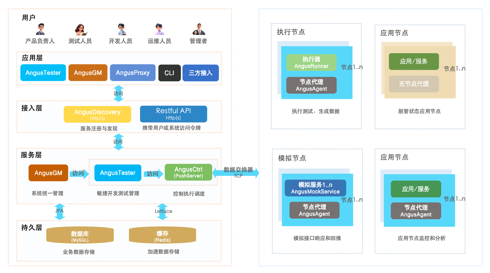
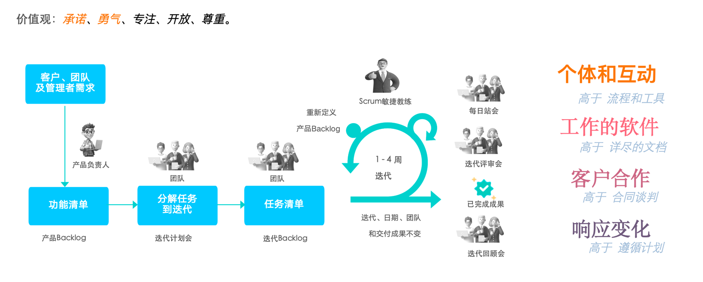
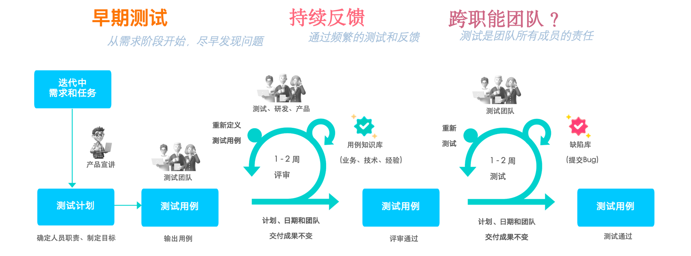

AngusTester
===

[English](README_en.md) | [中文](README.md)

[](https://spring.io/projects/spring-boot)
[](https://spring.io/projects/spring-cloud)
[](https://spring.io/projects/spring-cloud-netflix)
[](https://github.com/xcancloud/AngusInfra)
[](https://swagger.io/specification/)

## 产品介绍

**[AngusTester](https://www.xcan.cloud)**（简称`AT`）可以帮助软件开发团队高效且可持续地开展软件开发和测试活动，同时满足用户对敏捷开发和测试的要求。

***核心功能包括：*** 软件项目管理、功能测试、API测试、场景测试、服务模拟、数据模拟、报告和分析。

***目标用户包括：*** 产品负责人、测试人员、开发人员、运维人员和管理人员。

有关AngusTester应用详细介绍请查看：[产品文档](https://www.xcan.cloud/help/doc/205509853639082016?c=205515800021303296)。

## 系统架构

[AngusTester](https://www.xcan.cloud)系统架构图展示了主要应用程序、服务、组件之间的关系以及数据流，帮助您全面了解AngusTester如何快速部署。



## 产品特性

- **敏捷开发**：支持Scrum敏捷管理，确保开发和测试的灵活性，能够快速响应变化。
- **全面协作**：所有活动都是任务，支持对需求、故事、任务、缺陷、接口测试、场景测试和功能测试等开发和测试活动的跟进和管理。
- **高性能**：极高的测试性能，整体性能比JMeter提升30%以上，能够处理百万级并发连接和千万级QPS性能场景，适用于Http和WebSocket等协议。
- **分布式**：除单机测试外，支持分布式环境和跨地域的数百个压测节点测试。
- **自动化**：可以根据测试目标和重点自动生成测试用例和脚本，以及相应的执行配置。
- **智能化**：通过AI智能助手文本交互，可以查询知识库、编写测试用例和脚本，简化工作流程，提高工作效率。
- **插件化**：大大提高了应用程序的定制性、可扩展性和可维护性，允许用户在不升级主应用程序的情况下安装和更新插件。
- **基于规范的测试**：与用Python和C编写脚本不同，AngusTester使用YAML和JSON文本规范来定义脚本，使手动编写脚本更简单。
- **场景设计**：相比单步测试，场景包含更多步骤和流程；此外，用户可以用场景设计界面替代手动脚本编写。
- **API资产管理**：将后端开发API结果视为重要资产，并有效管理和维护，如在线编辑、调试和文档化接口。
- **多平台APIs导入**：支持导入多种数据格式，包括Swagger2.0、OpenAPI3.x、Postman2.0、Postman2.1，以及自定义导入扩展。
- **服务模拟**：快速生成和模拟您依赖的APIs，使开发和测试能够先行，实现更快的开发和更全面的测试；同时避免直接与生产系统集成造成的脏数据问题。
- **数据模拟**：支持丰富的数据模拟功能，与随机数据相比，为系统测试、服务模拟、项目演示等场景生成更真实的数据。
- **度量管理**：支持设置业务性能指标和测试指标（功能测试、性能测试、稳定性测试）。
- **以KPI为导向的评估**：支持对任务数量、工作量、逾期率、一次通过率、一次审核通过率等性能指标进行统计分析。
- **服务共享**：支持多租户，提供全面的RestFul风格APIs，易于与其他CI系统或开发系统集成。
- **成果共享**：最大化团队成员间脚本、参数化文件、场景设计、接口、报告等的共享。
- **专业报告**：支持16种业务模板设置和项目、功能测试、接口测试、场景测试、任务执行等报告生成。
- **扩展身份管理支持**：除内置身份管理外，还扩展支持LDAP/Active Directory服务和OAuth2用户单点登录认证。
- **安全性**：支持Https安全传输协议、数据级权限控制和基于策略的访问控制（PBAC）权限方案。

## 敏捷流程

- 敏捷开发

**通过迭代和增量交付来不断改进产品。** 开发团队将项目分解为多个小的、可管理的部分，称为“迭代”。每个迭代通常持续几周，团队在这个期间内会完成一定量的工作，并在每个迭代结束时交付一个可用的产品增量。

在每个迭代中，**团队会根据来自客户和利益相关者的反馈进行调整和改进。** 这种灵活性使得开发团队能够及时响应用户需求的变化，确保最终产品更符合用户的期望和需求。通过定期的回顾和反馈循环，团队可以识别问题、优化流程，并在后续的迭代中实施改进，从而不断提升产品质量和用户满意度。



- 敏捷测试

**敏捷软件开发环境中进行的软件测试，强调测试与开发的紧密协作。** 在敏捷开发中，测试并不是一个单独的阶段，而是与开发活动并行进行的。这种方法确保了测试人员能够在开发的早期阶段参与进来，从而更早地发现和解决问题。

**通过持续的反馈和协作，测试团队与开发团队密切合作，共同识别潜在的缺陷和风险。** 这种协作不仅包括测试用例的设计和执行，还涉及到对用户故事和需求的理解。敏捷测试的目标是提升软件的质量，确保软件在每个迭代中都能达到高标准，并满足用户的需求。



## 插件化实现

AngusTester的插件化实现支持以下插件：

- 功能插件

    - 功能测试 √
    - 安全测试
    - 事件通知 - 华为云短信 √
    - 事件通知 - 阿里云短信 √
    - Api签名

- 协议测试插件

    - Http(s)      √
    - WebSocket(s) √
    - JDBC √
    - TCP √
    - FTP √
    - LDAP √
    - SMTP √
    - MAIL(POP3/IMAP) √
    - JMS √
    - Dubbo
    - gRPC

- 中间件测试插件

    - 数据库：MySQL √, SQLServer √, Postgresql √, Oracle √
    - 缓存服务：Redis, Memcached
    - NoSQL：MongoDB √, ClickHouse, HBase, Cassandra, TSDB, InfluxDB
    - 消息队列：Kafka √, RabbitMQ √, ZeroMQ, RocketMQ

- Mock数据插件

    - MockCsv √
    - MockExcel √
    - MockJson √
    - MockSql √
    - MockTab √
    - MockXml √
    - MockCustom √

## 开发技术

**AngusTester**应用采用现代架构，前后端分离的技术方案进行开发。这种分离设计使得应用在灵活性、可扩展性和可维护性方面得到了显著提升。

当前项目是AngusTester的服务端，主要提供 **RESTful API**服务。后端的主要特点包括：

- **RESTful API 设计**：API 遵循 REST 原则，具有无状态性，并通过 GET、POST、PUT、PATCH 和 DELETE 等标准 HTTP 方法操作。这确保了与各种前端技术和平台的易集成。
- **可扩展性**：前后端的分离使得每个组件可以根据用户需求和系统负载独立扩展，提升了系统的整体性能。
- **可维护性**：采用模块化的方法，开发者可以在不影响其他部分的情况下更新或修改应用的某一部分，从而简化了后续的维护和功能扩展。

关于前端项目及其技术栈的详细信息，请参考 **[AngusTesterWeb](https://github.com/xcancloud/AngusTesterWeb.git)** 文档。前端旨在提供用户友好的界面，与后端 API 无缝交互。

以下是AngusTester项目主要技术栈：

| 技术类别           | 技术名称                               | 说明                          |
|-------------------|------------------------------------|-----------------------------|
| 开发语言           | OpenJDK 11+                       | 提供稳定且开放的Java运行环境和丰富的库支持。        |
| 企业级框架        | Spring Boot 2.4.3                  | 简化开发过程，支持快速构建和部署。           |
| SaaS服务开发框架   | XCanSDF 1.0.0                      | 帮助开发人员快速实现软件即服务的功能。         |
| 数据库            | MySQL(√), PostgreSQL(✗)               | 主要的关系型数据库，支持数据存储和管理。        |
| 数据库持久化      | JPA (Java Persistence API)         | 提供数据库操作的持久化层，使得数据访问更加简单和高效。 |
| 缓存中间件        | Redis                              | 提升系统性能，减少数据库负载。             |
| 缓存实现          | Lettuce                            | Redis的异步和反应式客户端，适合高吞吐量的场景。  |
| 全文搜索          | MySQL Fulltext Index(√), Elasticsearch(✗)| 支持高效的全文搜索功能，满足用户对信息检索的需求。   |
| 项目打包构建工具  | Maven 3+                           | 项目管理和构建工具，负责依赖管理和项目打包。      |


## 部署安装

以下是AngusTester应用和服务清单，具体安装过程请查看：[AngusTester安装说明](https://www.xcan.cloud/help/doc/205509853639082016?c=209786779925032562)：

| 应用/服务            | 安装包                                    | 默认端口      | 说明                                                                                                        |
|------------------|----------------------------------------|-----------|-----------------------------------------------------------------------------------------------------------|
| AngusInstaller   | [AngusInstaller-Community-1.0.0.zip](https://xcan-angustester.oss-cn-beijing.aliyuncs.com/AngusPackage/AngusInstaller-Community-1.0.0.zip) | 8800      | 应用安装器，提供 Web 界面方式对应用和服务进行安装和配置。                                                                           |
| AngusDiscovery   | [AngusCtrl-Community-1.0.0.zip](https://xcan-angustester.oss-cn-beijing.aliyuncs.com/AngusPackage/AngusDiscovery-Community-1.0.0.zip)      | 8801      | 注册中心服务，用于服务注册、发现、管理，并确保服务提供平衡和故障切换。`安装AngusGM时会自动安装`。                                                     |
| AngusGM          | [AngusGM-Community-1.0.0.zip](https://xcan-angustester.oss-cn-beijing.aliyuncs.com/AngusPackage/AngusGM-Community-1.0.0.zip)        | 8802、8803 | 全局管理应用，为“系统管理员”提供的统一系统资源管理平台，它用于管理和控制整个系统、组织或应用等。                                                         |
| AngusTester      | [AngusTester-Community-1.0.0.zip](https://xcan-angustester.oss-cn-beijing.aliyuncs.com/AngusPackage/AngusTester-Community-1.0.0.zip)    | 8901      | 敏捷开发、测试业务应用，主要功能包括任务协同、功能测试、API资产化、场景测试、服务模拟、数据模拟等。                                                       |
| AngusCtrl        | [AngusCtrl-Community-1.0.0.zip](https://xcan-angustester.oss-cn-beijing.aliyuncs.com/AngusPackage/AngusCtrl-Community-1.0.0.zip)      | 8902      | 控制器服务，用于任务控制、调度、监控、度量和分析。                                                                                 |
| AngusAgent       | [AngusAgent-1.0.0.zip](https://bj-c1-prod-files.xcan.cloud/storage/pubapi/v1/file/AngusAgent-Full-1.0.0.zip?fid=248565189237014528)               | 6807      | 节点代理服务，用于执行脚本任务，在代理节点上运行和管理 Mock 服务，收集、监控和报告关于节点的各种指标和性能数据。                                               |
| AngusProxy       | [AngusProxy-1.0.0.zip](https://bj-c1-prod-files.xcan.cloud/storage/pubapi/v1/file/AngusProxy-1.0.0.zip?fid=248565111927603200)               | 6806      | 请求代理服务，代理 Http 和 WebSocket 协议接口调试请求，解决浏览器跨域限制问题。                                                          |
| AngusMockService | [AngusMockService-1.0.0.zip](https://bj-c1-prod-files.xcan.cloud/storage/pubapi/v1/file/AngusMockService-1.0.0.zip?fid=248565111927603206)         | 30010     | Mock 服务，可以提供一个虚拟环境，让您能够模拟不同的接口响应、状态码和数据，快速生成并模拟您所依赖的 API。                                                 |
| AngusRunner | [AngusRunner-1.0.0.zip](https://bj-c1-prod-files.xcan.cloud/storage/pubapi/v1/file/AngusRunner-1.0.0.zip?fid=248565111927603202) | /      | 命令行工具和执行器，执行AngusCtrl下发给代理程序(AngusAgent)的运行测试和模拟数据任务，并将测试结果发送到服务端。 `安装AngusTester和AngusAgent完整安装包时会自动安装`。 |

## 贡献代码

GitHub贡献者指南：克隆、配置和运行AngusTester项目。本指南将引导您完成为GitHub上托管的AngusTester项目做出贡献的过程。

### 1. 克隆项目

1. 前往[GitHub](https://github.com/xcancloud/AngusTester.git)项目页面。
2. 点击"Code"按钮并复制HTTPS或SSH URL。
3. 打开终端并导航到您想要的目录。
4. 运行：
   ```bash
   git clone https://github.com/xcancloud/AngusTester.git
   ```
5. 进入项目目录：
   ```bash
   cd AngusTester
   ```

### 2. 设置Maven

1. 确保已安装Maven。通过运行以下命令检查：
   ```bash
   mvn -version
   ```
2. 如果未安装，从官方网站下载并安装Maven。
3. 在settings.xml文件中添加以下配置：
   ```xml
    <mirror>
      <id>xcan-maven-public</id>
      <mirrorOf>*</mirrorOf>
      <name>xcan public</name>
      <url>http://nexus.xcan.work/repository/xcan-maven-public/</url>
    </mirror>
   ```

### 3. 配置和构建项目

1. 在项目根目录打开`pom.xml`以查看依赖项。
2. 构建项目并下载依赖项：
   ```bash
   mvn clean install
   ```

### 4. 运行SpringBoot应用程序

1. 在项目根目录运行：
   ```bash
   mvn spring-boot:run
   ```
   **注意：需要确保AngusDiscovery服务注册中心正在运行。**
2. 等待"Started Application Success"消息。
3. 打开Web浏览器并访问`http://localhost:1830/swagger-ui/`进行验证。

### 5. 提交代码

1. 创建新分支：
   ```
   git checkout -b dev/your-feature-name
   ```
2. 进行代码更改。
3. 提交更改：
   ```bash
   git add .
   git commit -m "描述您的更改"
   ```
4. 推送到GitHub：
   ```bash
   git push origin dev/your-feature-name
   ```
5. 前往GitHub项目页面并创建`Pull Request`。

## 反馈

请将您的反馈邮件发送至：feedback@xcan.cloud

在线工单反馈地址：[https://www.xcan.cloud/support](https://www.xcan.cloud/support)

再次衷心感谢您的支持！特别感激您的分享和转发。

诚挚致谢！

AngusTester团队！
