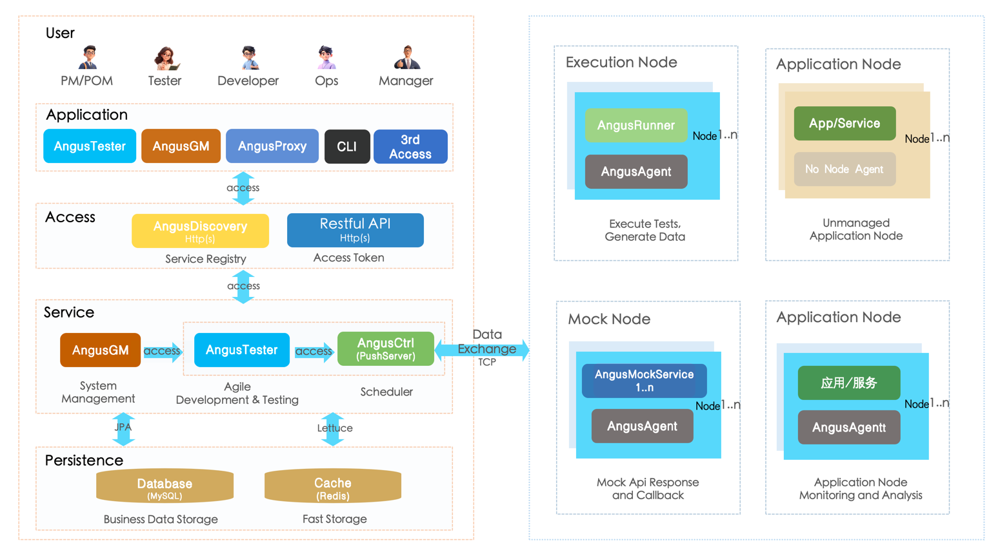
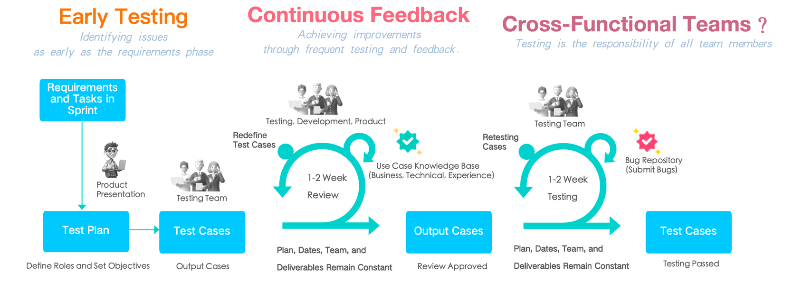

AngusTester
===

[English](README_en.md) | [中文](README.md)

[](https://spring.io/projects/spring-boot)
[](https://spring.io/projects/spring-cloud)
[](https://spring.io/projects/spring-cloud-netflix)
[](https://github.com/xcancloud/AngusInfra)
[](https://swagger.io/specification/)

## Introduction

**[AngusTester](https://www.xcan.cloud)** (referred to as `AT`) is designed to assist software development teams in efficiently and sustainably carrying out software development and testing activities, while fulfilling the agile development and testing requirements of users.

Core functions include software project management, functional testing, API testing, scenario testing, service mock, data mock, reporting, and analysis.

Target users consist of product owners, testers, developers, operations personnel, and managers.

For a detailed introduction to the AngusTester application, please see the: [Product Documentation](https://www.xcan.cloud/help/doc/205509853639082016?c=205515800021303296).

## Architecture

The [AngusTester](https://www.xcan.cloud) system architecture diagram illustrates the relationships among the main applications, services, components, and data flow. This diagram provides a comprehensive overview of how AngusTester can be deployed rapidly and effectively.



## Features

- **Agile Development**: Supports Scrum agile management, ensuring flexibility in development and
  testing, capable of rapidly responding to changes.
- **Comprehensive Collaboration**: All activities are tasks, supporting follow-up and management of
  development and testing activities such as requirements, stories, tasks, bugs (defects), interface
  testing, scenario testing, and functional testing.
- **High Performance**: Extremely high testing performance, with an overall performance improvement
  of over 30% compared to JMeter, capable of handling millions of concurrent connections and tens of
  millions of QPS performance scenarios for protocols such as Http and WebSocket.
- **Distributed**: In addition to single-machine testing, supports distributed environments and
  testing with hundreds of pressure testing nodes across different geographical regions.
- **Automation**: Can automatically generate test cases and scripts, as well as corresponding
  execution configurations based on test objectives and focus points.
- **Intelligence**: Allows querying knowledge bases, writing test cases, and scripts through AI
  intelligent assistant text interaction, simplifying workflows and improving work efficiency.
- **Plugin-based**: Greatly improves the customizability, extensibility, and maintainability of
  applications, allowing users to install and update plugins without upgrading the main application.
- **Specification-based Testing**: Unlike writing scripts in Python and C, AngusTester uses YAML and
  JSON text specifications to define scripts, making manual script writing simpler.
- **Scenario Design**: Compared to single-step testing, scenarios contain more steps and processes;
  additionally, users can replace manual script writing with the scenario design interface.
- **API Asset Management**: Treats backend development API results as important assets, and
  effectively manages and maintains them, such as online editing, debugging, and documenting
  interfaces.
- **Multi-platform Apis Import**: Supports import of multiple data formats including Swagger2.0,
  OpenAPI3.x, Postman2.0, Postman2.1, as well as custom import extensions.
- **Service Mock**: Quickly generates and simulates the APIs you depend on, enabling development and
  testing to proceed first, achieving faster development and more comprehensive testing; also avoids
  dirty data issues caused by direct integration with production systems.
- **Data Mock**: Supports rich data simulation functions, generating more realistic data compared to
  random data for system testing, service simulation, project demonstrations, and other scenarios.
- **Metric Management**: Supports setting of business performance metrics and test metrics (
  functional testing, performance testing, stability testing).
- **KPI-oriented Assessment**: Supports statistical analysis of performance indicators such as
  number of tasks, workload, overdue rate, first-time pass rate, and first-time review pass rate.
- **Service Sharing**: Multi-tenant support, providing comprehensive RestFul style APIs for easy
  integration with other CI systems or development systems.
- **Achievement Sharing**: Maximizes sharing of scripts, parameterized files, scenario designs,
  interfaces, reports, etc., among team members.
- **Professional Reporting**: Supports 16 types of business template settings and report generation
  for projects, functional testing, interface testing, scenario testing, task execution, etc.
- **Extended Identity Management Support**: In addition to built-in identity management, extends
  support for LDAP/Active Directory services and OAuth2 user single sign-on authentication.
- **Security**: Supports Https secure transmission protocol, data-level permission control, and
  policy-based access control (PBAC) permission schemes.

## Agile Process

- Agile Development

**Continuously improve the product through iterative and incremental delivery.** The development team breaks the project into smaller, manageable parts called “iterations.” Each iteration typically lasts a few weeks, during which the team completes a set amount of work and delivers a usable product increment at the end.

In each iteration, **the team adjusts and improves based on feedback from customers and stakeholders.** This flexibility allows the development team to respond promptly to changes in user demands, ensuring the final product better aligns with user expectations. Through regular reviews and feedback loops, the team can identify issues, optimize processes, and implement improvements in subsequent iterations, thereby continuously enhancing product quality and user satisfaction.


- Agile Testing

**Software testing in an agile development environment emphasizes close collaboration between testing and development.** In agile development, testing is not a separate phase but occurs concurrently with development activities. This approach ensures that testers can engage early in the development process, allowing for earlier identification and resolution of issues.

**Through continuous feedback and collaboration, the testing team works closely with the development team to identify potential defects and risks.** This collaboration involves not only the design and execution of test cases but also understanding user stories and requirements. The goal of agile testing is to improve software quality, ensuring that it meets high standards in each iteration and fulfills user needs.



## Plugins Support

AngusTester's plugin-based implementation supports the following plugins:

- Functional Plugins

    - Functional Testing √
    - Security Testing
    - Event Notification - Huawei Cloud SMS √
    - Event Notification - Alibaba Cloud SMS √
    - Api Signature

- Protocol Testing Plugins

    - Http(s)      √
    - WebSocket(s) √
    - JDBC √
    - TCP √
    - FTP √
    - LDAP √
    - SMTP √
    - MAIL(POP3/IMAP) √
    - JMS √
    - Dubbo
    - gRPC

- Middleware Testing Plugins

    - Databases: MySQL √, SQLServer √, Postgresql √, Oracle √
    - Cache Services: Redis, Memcached
    - NoSQL: MongoDB √, ClickHouse, HBase, Cassandra, TSDB, InfluxDB
    - Message Queues: Kafka √, RabbitMQ √, ZeroMQ, RocketMQ

- Mock Data Plugins

    - MockCsv √
    - MockExcel √
    - MockJson √
    - MockSql √
    - MockTab √
    - MockXml √
    - MockCustom √

## Develop Technology

**AngusTester** application is developed using a modern architecture with a separation of frontend and backend technologies. This separation design significantly enhances the application's flexibility, scalability, and maintainability.

The current project serves as the backend for AngusTester, primarily providing **RESTful API** services. The main features of the backend include:

- **RESTful API Design**: The APIs adhere to REST principles, being stateless and operating through standard HTTP methods such as GET, POST, PUT, PATCH, and DELETE. This ensures easy integration with various frontend technologies and platforms.
- **Scalability**: The separation of frontend and backend allows each component to scale independently based on user demand and system load, improving overall system performance.
- **Maintainability**: By adopting a modular approach, developers can update or modify a specific part of the application without affecting others, thereby simplifying ongoing maintenance and feature enhancements.

For detailed information about the frontend project and its technology stack, please refer to the **[AngusTesterWeb](https://github.com/xcancloud/AngusTesterWeb.git)** documentation. The frontend aims to provide a user-friendly interface that interacts seamlessly with the backend APIs.

Below is the main technology stack for the AngusTester project:

| Category           | Technology Name                           | Description                                               |
|--------------------|------------------------------------------|-----------------------------------------------------------|
| Programming Language | OpenJDK 11+                              | Provides a stable and open Java runtime environment with rich library support. |
| Enterprise Framework | Spring Boot 2.4.3                        | Simplifies the development process and supports rapid building and deployment. |
| SaaS Development Framework | XCanSDF 1.0.0                          | Helps developers quickly implement Software as a Service (SaaS) functionalities. |
| Database           | MySQL(√), PostgreSQL(✗)                     | Major relational databases that support data storage and management. |
| Database Persistence | JPA (Java Persistence API)               | Provides a persistence layer for database operations, making data access simpler and more efficient. |
| Caching Middleware  | Redis                                    | Enhances system performance and reduces database load.    |
| Caching Implementation | Lettuce                                  | An asynchronous and reactive client for Redis, suitable for high-throughput scenarios. |
| Full-text Search   | MySQL Fulltext Index(√), Elasticsearch(✗)   | Supports efficient full-text search functionality to meet users' information retrieval needs. |
| Project Build Tool | Maven 3+                                 | Project management and build tool responsible for dependency management and project packaging. |

Here’s the translation of your text into English, while keeping the Markdown format:

## Deployment Installation

The following is a list of applications and services for AngusTester. For the specific installation process, please refer to the: [AngusTester Installation](https://www.xcan.cloud/help/doc/205509853639082016?c=209786779925032562):

| Application/Service   | Installation Package                                 | Default Port | Description                                                                                                   |
|-----------------------|----------------------------------------------------|--------------|---------------------------------------------------------------------------------------------------------------|
| AngusInstaller         | [AngusInstaller-Community-1.0.0.zip](https://xcan-angustester.oss-cn-beijing.aliyuncs.com/AngusPackage/AngusInstaller-Community-1.0.0.zip) | 8800         | Application installer, providing a web interface for installing and configuring applications and services.     |
| AngusDiscovery         | [AngusCtrl-Community-1.0.0.zip](https://xcan-angustester.oss-cn-beijing.aliyuncs.com/AngusPackage/AngusDiscovery-Community-1.0.0.zip)      | 8801         | Registry service for service registration, discovery, management, and ensuring load balancing and failover. `Automatically installed when installing AngusGM`.   |
| AngusGM                | [AngusGM-Community-1.0.0.zip](https://xcan-angustester.oss-cn-beijing.aliyuncs.com/AngusPackage/AngusGM-Community-1.0.0.zip)        | 8802, 8803   | Global management application, a unified system resource management platform for "system administrators" to manage and control the entire system, organization, or application. |
| AngusTester            | [AngusTester-Community-1.0.0.zip](https://xcan-angustester.oss-cn-beijing.aliyuncs.com/AngusPackage/AngusTester-Community-1.0.0.zip)    | 8901         | Agile development and testing business applications, main features include task collaboration, functional testing, API assetization, scenario testing, service simulation, and data simulation. |
| AngusCtrl              | [AngusCtrl-Community-1.0.0.zip](https://xcan-angustester.oss-cn-beijing.aliyuncs.com/AngusPackage/AngusCtrl-Community-1.0.0.zip)      | 8902         | Controller service for task control, scheduling, monitoring, metrics, and analysis.                           |
| AngusAgent             | [AngusAgent-1.0.0.zip](https://bj-c1-prod-files.xcan.cloud/storage/pubapi/v1/file/AngusAgent-Full-1.0.0.zip?fid=248565189237014528)               | 6807         | Node agent service for executing script tasks, running and managing Mock services on agent nodes, collecting, monitoring, and reporting various metrics and performance data about the nodes. |
| AngusProxy             | [AngusProxy-1.0.0.zip](https://bj-c1-prod-files.xcan.cloud/storage/pubapi/v1/file/AngusProxy-1.0.0.zip?fid=248565111927603200)               | 6806         | Request proxy service for proxying HTTP and WebSocket protocol interface debugging requests, solving browser cross-origin restriction issues. |
| AngusMockService       | [AngusMockService-1.0.0.zip](https://bj-c1-prod-files.xcan.cloud/storage/pubapi/v1/file/AngusMockService-1.0.0.zip?fid=248565111927603206)         | 30010        | Mock service that provides a virtual environment to simulate different interface responses, status codes, and data, allowing you to quickly generate and mock the APIs you rely on. |
| AngusRunner            | [AngusRunner-1.0.0.zip](https://bj-c1-prod-files.xcan.cloud/storage/pubapi/v1/file/AngusRunner-1.0.0.zip?fid=248565111927603202) | /            | Command-line tool and executor that executes running tests and simulated data tasks sent to the agent program (AngusAgent) by AngusCtrl and sends the test results back to the server. `Automatically installed when installing the complete packages of AngusTester and AngusAgent`. |

## Contribute Code

GitHub Contributor's Guide for Clone, Configure, and Run AngusTester Project This guide will walk you
through the process of contributing to AngusTester project hosted on GitHub.

### 1. Clone the Project

1. Go to the [GitHub](https://github.com/xcancloud/AngusTester.git) project page.
2. Click the "Code" button and copy the HTTPS or SSH URL.
3. Open your terminal and navigate to your desired directory.
4. Run:
   ```bash
   git clone https://github.com/xcancloud/AngusTester.git
   ```
5. Enter the project directory:
   ```bash
   cd AngusTester
   ```

### 2. Set Up Maven

1. Ensure Maven is installed. Check by running:
   ```bash
   mvn -version
   ```
2. If not installed, download and install Maven from the official website.
3. Add the following configuration to the settings.xml file:
   ```xml
    <mirror>
      <id>xcan-maven-public</id>
      <mirrorOf>*</mirrorOf>
      <name>xcan public</name>
      <url>http://nexus.xcan.work/repository/xcan-maven-public/</url>
    </mirror>
   ```

### 3. Configure and Build the Project

1. Open `pom.xml` in the project root to review dependencies.
2. Build the project and download dependencies:
   ```bash
   mvn clean install
   ```

### 4. Run the SpringBoot Application

1. In the project root, run:
   ```bash
   mvn spring-boot:run
   ```
   **Note: It is necessary to ensure that the AngusDiscovery service registry is running.**
2. Wait for the "Started Application" message.
3. Open a web browser and go to `http://localhost:1830/swagger-ui/` to verify.

### 5. Make Changes and Contribute

1. Create a new branch:
   ```
   git checkout -b dev/your-feature-name
   ```
2. Make your code changes.
3. Commit your changes:
   ```bash
   git add .
   git commit -m "Describe your changes"
   ```
4. Push to GitHub:
   ```bash
   git push origin dev/your-feature-name
   ```
5. Go to the GitHub project page and create a Pull Request.

## Feedback

Please send your feedback email to: `feedback@xcan.cloud`.

Online ticket feedback address: [https://www.xcan.cloud/support](https://www.xcan.cloud/support)

Thank you again for your support! We especially appreciate your sharing and forwarding.

Sincerely grateful!

The AngusTester Team!
